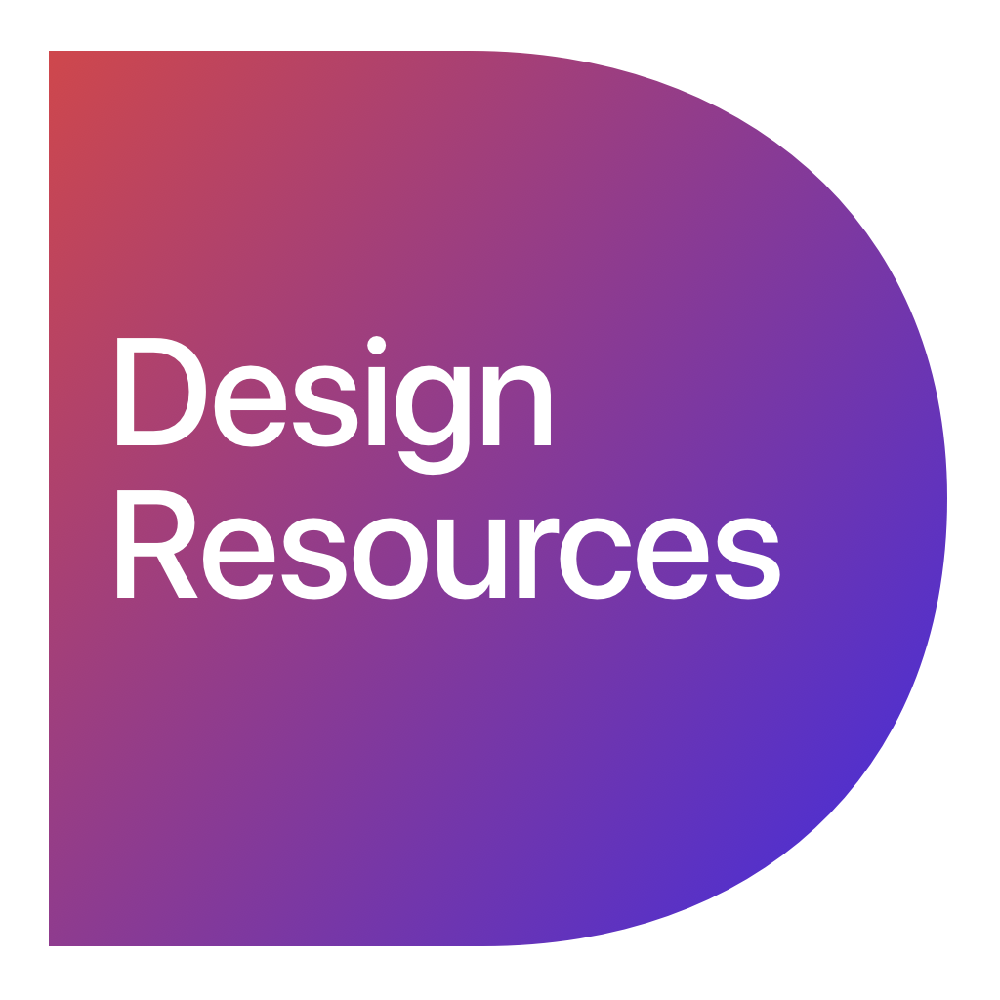

<h1 align="center">
  
   
   
  Design Resources
</h1>

<h4 align="center">Repository with useful design resources</h4>

  
  
  

#### Resources

A curated list of awesome Design resources.

#### Code Style

#### License

All trademarks and copyrights are property of their respective owners.
